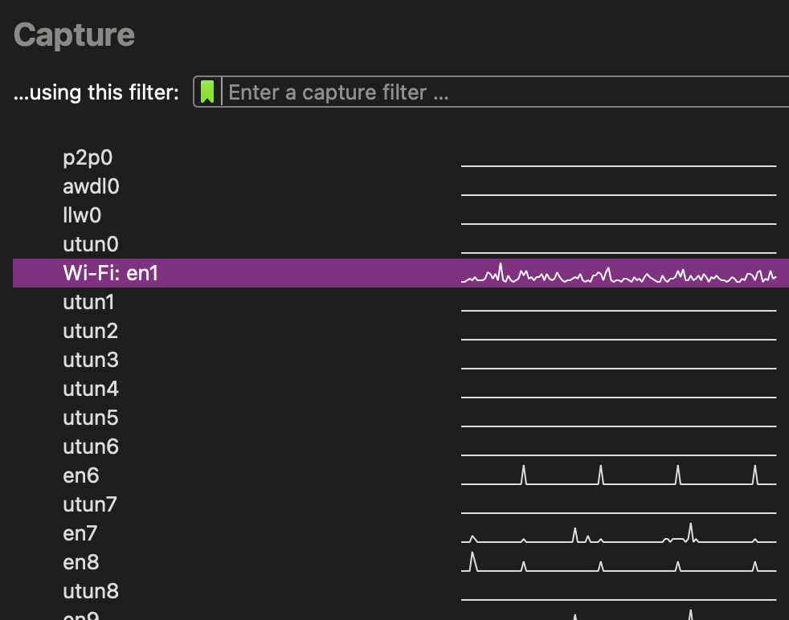
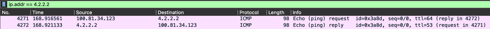
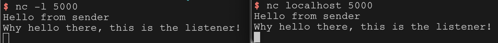

# [CSE190/291 – Wireless & The IoT](../labs.html)

## Lab 1: Playing with your local network

The purpose of today’s lab is to solidify your background in the ‘nuts & bolts’ of Internet technologies, and to give some empirical experience in ‘peeling back layers’ of the Internet.

This should hopefully be a fun bit of poking around with what your computer is actually doing all the time — for better or worse, I always find something new every time I look at the firehose of packets coming in and out of my machine #NotASecurityProfessor.

[TOC]

---

## PreLab

First, make a copy of the [PreLab Report Document][prelab1] to fill in as you work.

### A. Install Wireshark

We will use Wireshark, [available here](https://www.wireshark.org/).
Follow the installation instructions to set up wireshark on _each group members'_ machine.

> Sometimes, you can run into some permission headaches getting wireshark access to your network traffic.
> The modern installer is pretty good at getting all the permissions it needs, but if you have issues, Google is going to be a better bet for debugging than staff probably.
>
> It is not a good idea to run Wireshark as root — it’ll get all the packets, sure, but that’s really opening yourself up for trouble #OkayIDoListenToTheSecurityProfessorsSometimes.

__There is no deliverable for this section.__

### B. Get comfortable with Wireshark

When you start Wireshark, you have to tell it where to capture packets from.
In practice, this is a list of cryptic, short names; e.g. here’s what I see:

_I have active VMs on this machine, can you tell?_

**PreLab Q1:** What interfaces are available on your machines?

**PreLab Q2:** Where's WiFi?

**PreLab Q3:** What's all this other stuff?

### C. Have a "unix-like" Environment Available

If you have a Linux-based laptop of a Mac, you do not need to do anything here.

If you have a Windows-based machine, please set up the
[Windows Subsystem for Linux (WSL)](https://docs.microsoft.com/en-us/windows/wsl/install).
We recommend Ubuntu, but any environment should suffice.

__There is no deliverable for this section.__

---

## In-Lab

First, make a copy of the [PostLab Report Document][postlab1] to fill in as you work.
Some questions are tagged _PostLab_.
Don't try to do these during the lab session or you will fall behind.

> **Warning:** In general, be careful when sniffing traffic.
> It can be illegal to monitor communications you were not supposed to have access to.

### A. [5 min] Finding and inspecting your own traffic

1. Open a terminal window and run:

        ping 4.2.2.2

1. Open wireshark, and start collecting traffic on your default interface.

1. Add a filter:

        ip.addr==4.2.2.2

1. You should see something like this:

    

1. Explore a bit in Wireshark, what can you learn about the packet you are observing?

1. Stop the capture. Go to `File → SaveAs` and
   [save a copy of this capture][wiresharkSaveDirections] to use during your postlab writeup.

> **PostLab: Document your results.**

### B: [10 min] Insecure Chat

For this section, we will use the [netcat (`nc`) utility](https://en.wikipedia.org/wiki/Netcat).
If using MacOS or Linux, this is probably already built-in to your machine. If using Windows, you can get the `ncat` tool by installing the [nmap package](https://nmap.org/download.html#windows). 

1. Ensure all of your group's machines are on the same wireless network.

1. One one machine, set up a “listen” (`nc -l [PORT]`) endpoint.

1. On another machine, connect to the listening machine (`nc [IP] [PORT]`).

1. Try typing messages into each endpoint. You should be able to chat!

    
    _What is "localhost"? Why can't you use that?_

1. Start a wireshark capture on all three group member machines (i.e., the
   sender, the listener, and someone not running netcat).

1. After sending a few messages back and forth, stop and save the captures on all machines.

1. Add a filter so that you are only looking at traffic from your chat session.
   (_Hint: what unique number did you control when you set this chat up?_)

1. Which machines can you see your chat traffic in Wireshark? Why?

> **PostLab: Document your results.**

### C: [5 min] Discover WiFi Networks Around You

Computers discover WiFi routers using a variety of _probe packets_.
These probe packets contain information such as the name of the WiFi network (SSID), signal strength information, security capabilities, etc.

1. Start a new capture watching the WiFi interface on one of your machines.

1. We are running a test network in lab, named something like `WxIoT-XXX`.
   _Without connecting to it_, can you find it?

1. Let this run for about thirty seconds, then stop and save the capture.

1. What are the types of probe packets you can see from our test network?

> **PostLab: Document your results.**

### D: [10 min] Snooping Connection Formation

Next, let’s try to capture connection formation between a computer and the wireless router.

1. Start a new capture watching the WiFi interface on _two_ of your machines (one connector, one watcher).

1. Connect one computer to the test wireless network.

1. Once the connection is complete, wait another ten-ish seconds, then stop and save the capture.

1. Start on the machine that you used to make the connection:

    1. Filter the traffic to isolate the connection process.

    1. What is the first type of packet that the computer sends to the router to initiate connection formation?

    1. How do you figure out which packet is sent next? Is there some information in the packet that helps you identify this?

    1. How do you know when the connection is established?

1. Now look at the connection from the observer's perspective.
   How much information can you see?

> **PostLab: Document your results.**

---

### E: Extra Credit– Polite WiFi

> **Warning:** This is a fair amount of work.
> It is truly _extra_ credit.

This is an opportunity to explore further into WiFi operation if you are interested.

[A recent paper][politeWifi] showed that anyone can force WiFi devices to
generate spurious acknowledgement messages, even when they are not connected to
the same network.

**Using devices you own,** replicate this result, and show how to force one of
your devices to generate spurious acknowledgements.

---

## PostLab

Go back and fill in the _PostLab_ questions in the PostLab Report Document.

Once you are finished, submit your report via Gradescope.

[prelab1]: https://docs.google.com/document/d/1C9w9rrGac0Vdf0zN1_VMs1bQ4JD2F1WXLCKaRAAOVCo/
[postlab1]: https://docs.google.com/document/d/1CePm0s07Tmdg0lKCjiWVnsKrav0tng1kbLPH6wSlebY/
[wiresharkSaveDirections]: https://www.wireshark.org/docs/wsug_html_chunked/ChIOSaveSection.html
[politeWifi]: http://web.cs.ucla.edu/~omid/Papers/Hotnets20b.pdf
