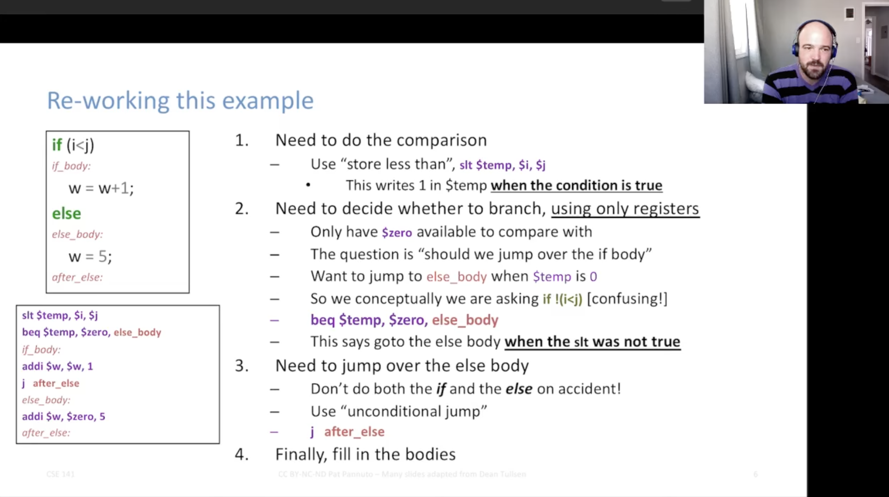
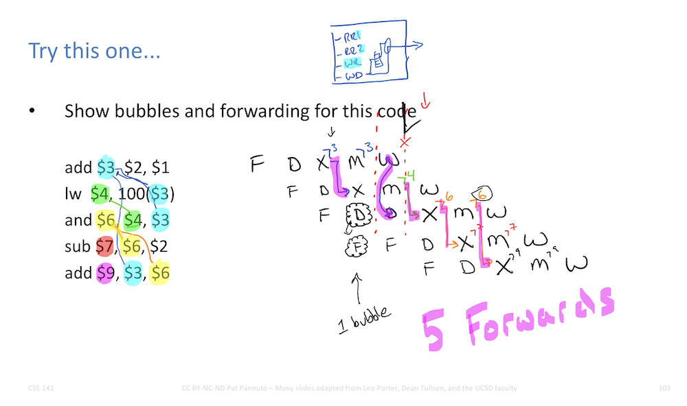

<div align="center" markdown="1">
[Pat Pannuto](/)
----------------
</div>

----

CSE 141: Introduction to Computer Architecture
=====================================

<div class="row flex-nowrap no-gutters">
<div class="col-lg-2 col-xs-4">

</div>
<div class="col-lg-2 col-xs-4">

</div>
<div class="col-lg-2 col-xs-4">

</div>
<div class="col-lg-2 d-none d-sm-block">

</div>
<div class="col-lg-2 d-none d-sm-block">

</div>
<div class="col-lg-2 d-none d-sm-block">

</div>
</div>

---

## Overview

The course covers the basics of modern processor design and operation.
Topics include instruction set architectures, computer system performance, machine organization, pipelining, branch prediction, memory-hierarchy design, and an introduction to multiprocessor considerations (and possibly security considerations and/or introduction to low-power design as well).

This course is designed to run alongside CSE 141L.
We expect that you are enrolled in both.

> If you cannot enroll in both because of scheduling, waitlists, etc, it is more important to complete CSE 141 first.
> You can succeed in CSE 141 without the partner lab, you very likely cannot succeed in 141L without having the 141 material.

### Learning Goals of 141+141L

At the end of the CSE&nbsp;141 series, students should be able to:

1. Make or support ISA design decisions with respect to the types of operations, the ways to impact control flow, and the number (and types) of operands.
2. Apply the Performance Equation and Amdahl's Law to evaluate processor designs.
3. Design single-cycle and pipelined processors.
4. Determine cache performance given a particular cache design and an address stream.
5. Evaluate and optimize program performance on a particular architecture and memory hierarchy.
6. Describe the role of Virtual Memory and evaluate memory designs (including the Translation Lookaside Buffer and its corresponding caches).
7. Explain the performance benefits of pipelining, superscalar, and out-of-order execution.

---

[TOC]

---

## Syllabus

> #### DISCLAIMER
>
> Due to our continued unusual circumstances, the details in this syllabus may change (e.g. schedule, grading policy, assignments, etc.). We will update this syllabus in the event of changes as the course progresses.

### Course Staff

[Pat Pannuto](https://patpannuto.com) is the instructor and their office is [CSE 3202](https://cse.ucsd.edu/about/floormaps) (right in the corner).
Their email is [ppannuto@ucsd.edu](mailto:ppannuto@ucsd.edu?Subject=CSE141:);
please remember to include `CSE141` in the subject line for class issues.

##### What should you call me?
Most students call me Professor or Professor Pannuto or Dr. Pannuto.
I also answer happily to &ldquo;Prof[essor] P.&rdquo;

##### What should I call you?
I should call you by your preferred name, with the correct pronunciation and any honorific or pronouns you choose.
Please correct me (in the chat if there is one, out loud in class or in Zoom, or via email/Piazza after the fact – however you are most comfortable) if I ever make a mistake.


#### TAs

 - Adithya Anand – ananand@ucsd.edu
 - Link Lin – yul065@ucsd.edu
 - Wenshan Luo - w1luo@ucsd.edu
 - Rahul Polisetti – rpolisetti@ucsd.edu


### Prerequisites

CSE 140 and 140L are required prerequisites for this course.
We expect that you are comfortable with the basics of digital logic, including the fundamentals of logic timing and how 1's and 0's can be used for higher-level operations like addition.

We further expect a basic familiarity with C or C-like code, i.e. you should be comfortable understanding what the following code does:

<small markdown="1">
```c
int twoDarray[256][256];
int sum = 0;

for (int i=0; i<256; i++) {
  for (int j=0; j<256; j++) {
    sum += twoDarray[i][j];
  }
}

printf("%d\n", sum);
```
</small>

### Textbook

`Computer Organization and Design MIPS Edition, The Hardware/Software Interface, Fifth Edition (Patterson & Hennessy)`
<small>(ISBN-13: 978-0124077263, ISBN-10: 0124077269)</small>

The textbook is required for this course.

#### Other recommended reading

 - Hennessy & Patterson, "Computer Architecture: A Quantitative Approach", Morgan Kaufmann
    - A more advanced treatment of many of the same topics in the textbook, as well as a lot more breadth.
 - Synthesis Lectures on Computer Architecture
    -  This contains a number of truly outstanding (and very recent and up-to-date) books on computer architecture, any of which you can download free while in the UCSD domain. In particular, see the books on Processor Microarchitecture (most useful for this class), Performance Evaluation Methods, Memory System, and Multithreading Architectures.

### Schedule

Lectures are Tue/Thr from 15:30 to 16:50 US/Pacific, in P416 WEST (the tents between Mandeville Ln and the Library Walk).

Discussion is Wed from 18:00 to 18:50 US/Pacific, in P416 EAST (the tents between Mandeville Ln and the Library Walk).

#### (A?)Sychronous?, Remote?, Recordings?

This course is designed for synchronous, in-person instruction.
That said, life happens, so we will make _best-effort_ attempts to stream the
lectures via Zoom and will make these recordings available in Canvas.
Please be sure to review the [Participation](#15-participation-peer-instruction) section in detail as well.

#### Office Hours

Up-to-date office hours are available in Canvas.


### Grading

A quick reminder: Effective learning comes from **active engagement** and **re-enforcement**.
Activities, assignments, and grading are designed to help with this.

_You get out of class what you put into it._

#### 15%: Participation (Peer Instruction)

During lectures, we will have interactive question and answer segments.
These are opportunities to check your understanding and for us to go back and help explain concepts more thoroughly that may be confusing folks.
These in-lecture polls will not be graded for correctness, simply for participation.

> ##### Accommodating Missed Lectures via Mini-Quizzes
>
> There's a lot going on lately, and we recognize that this means folks are more
> often going to need to miss a few lectures.
> If you are unable to attend class for any reason, you can complete that classes mini-quiz as a make-up **up to four times during the quarter**.
> You do not need to contact anyone, simply do the quiz and we will replace up to four participation zero's with quiz completions at the end of the term.
> (Note: These must "match", i.e. if you have a zero for participation on April 5, then only the April 5 quiz can replace it.)
> _For exceptional situations that require more than four make-ups, please contact Professor Pannuto directly._
>
> These quizzes are primarily for you, to help you stay on track and to check your own understanding.
> Therefore, we **will not grade them for correctness** (Canvas sometimes insists on giving you a score; you can safely ignore it).
> The quiz must be completed by 3:30PM US/Pacific (i.e. before class) the following week.
> If you complete the quiz, you will earn full points.
> However, if your raw score on a quiz is low, _come to discussion sections and office hours and get help!_
>
> Persons who did attend lecture and would just like some extra practice are welcome to complete the quizzes as well.

> ##### Mini-Quiz Late Policy
>
> As the purpose of these mini-quizzes is to help you keep up with class, there will be no extensions or late submissions.

#### 30%: Homework

These are longer form assignments, designed to test your individual understanding.
You are welcome discuss homework problems with other students or in groups, however, you must complete your final writeup alone.

Homework submission will be via the Gradescope module in Canvas.
Regrade requests will also be handled via Gradescope.
The window for regrades will be no more than one week after graded homework is returned.

Generally, homework will be released every Thursday and due the following Thursday, before the start of class (i.e. at 15:30).
We expect to release a homework assignment every week, with exceptions for the midterm week, final exam week, and possibly holidays, which should result in around 7-8 homework assignments over the quarter.

> ##### Homework Late Policy
>
> _Homework ever is better than homework never._
>
> The goal of homework is to help you to understand better by working through problems on your own.
> To that end, we will allow for late submission of homework at any point until the next exam (i.e. once the Midterm starts, you can no longer submit any homework assigned before the Midterm).
> Late homework will receive 50% of earned points.
> Late homework is not eligible for regrades and will be graded and returned at instructor convenience.
> Late homework should take care to add extra details showing how you, personally worked through problems and that your work is your own.
> Late homework that is "just answers" or otherwise does not clearly show your own work will receive no credit.

#### 25%: Midterm

This course will have one midterm exam.

#### 30%: Final Exam

The final exam will be cumulative over all of the course content.

##### Midterm, Final Format
Exams will be pen/pencil-only. You may not have a notesheet,
calculator<sup>&dagger;</sup>, or any other additional resources.
We will provide a (possibly slightly modified) copy of the MIPS Green
Card with exams.

Most of the exam questions will be very similar to the homework assignments,
namely questions with large areas for open-ended free response. Some questions
may include (possibly slightly modified) copies of processor diagrams similar
to these shown in lecture and in homework.
In addition, there may be some &ldquo;fill-in-the-blank&rdquo;, multiple
choice, and True/False questions.

For purposes of ensuring academic integrity and in accordance with
[UCSD](https://students.ucsd.edu/_files/student-conduct/Standards%20of%20Conduct.pdf) and
[UCoP](https://www.ucop.edu/student-equity-affairs/policies/pacaos.html) policies,
we may video record the examination area for the duration of the exam process.


<small><sup>&dagger;</sup>Some questions may require basic arithmetic.
You may leave the answer to any free-response question in fraction form.
A calculator will not be necessary for the satisfactory completion of any problem.
</small>

#### Final Grades

I believe in mastery learning. My goal is to teach you the material in 141
and for everyone to learn it. I am most successful if everyone in class
_earns_ an `A`. This class will not be curved.
<small>I reserve the right to curve sub-components, in particular exams.
The last time I taught this course, I curved the Midterm up very slightly
and did not curve the final.</small>

<div class="table-responsive">
<table class="table grade-table">
  <tr>
    <th>A+<br /><small>&gt;96.7</small></th>
    <th>A<br /><small>[93,96.7)</small></th>
    <th>A-<br /><small>[90,93)</small></th>
    <th>B+<br /><small>[86.7,90)</small></th>
    <th>B<br /><small>[83.3,86.7)</small></th>
    <th>B-<br /><small>[80,83.3)</small></th>
    <th>C+<br /><small>[76.7,80)</small></th>
    <th>C<br /><small>[73.3,76.7)</small></th>
    <th>C-<br /><small>[70,73.3)</small></th>
    <th>D<br /><small>[60,70)</small></th>
    <th>F<br /><small>[0,60)</small></th>
  </tr>
</table>
</div>
<small><em>Range notation [90,93) means 90 is included and 93 is not</em></small>

##### Extra Credit? Grade Bumps?

There will be no extra credit in this class. I will not &ldquo;bump&rdquo;
grades up that are &ldquo;close&rdquo; to a cutoff (becuase, then someone
else is close to the new &ldquo;bump cutoff,&rdquo; drawing new arbitrary
lines will always be unfair to someone).

##### CAPEs Incentive

If, at the end of the term, the CAPE response rate is >=90.0%, we will
drop everyone's lowest homework grade.

### Academic Integrity

In this course we expect students to adhere to the [UC San Diego Integrity of Scholarship Policy](https://senate.ucsd.edu/Operating-Procedures/Senate-Manual/Appendices/2).
This means that you will complete your work honestly, with integrity, and support an environment of integrity within the class.

Cheating WILL be taken seriously.
It is not fair to honest students to take cheating lightly, nor is it fair to the cheater to let them go on thinking that is a reasonable alternative in life.

The following is not considered cheating:

 - Discussing homework in groups (with the writeup done separately, later).
 - Discussing additional, unassigned problems (e.g. nearby numbers in the back-of-chapter problem lists) in any way, shape, or form.

The following is:

 - Discussing homework with someone who has already completed the problem, or looking at their completed write-up.
 - Using homework solutions from the web, previous versions of the class, or anywhere else.
 - Receiving, providing, or soliciting assistance from another student during a test.

Homework is not intended to be a grade-maker, but to prepare you for the tests, which are the grade-makers.
Cheating on homework just hurts you.
If you are choosing between not turning in an assignment, or using somebody's else work, do yourself a favor and just don't turn it in.
You are facing a permanent mark on your academic record and a certainty of having to explain it to any future employer or school that you apply to.

If you are caught cheating on any assignment, you will first be flagged with an
`X` course grade, which prevents you from withdrawing from the course for any
reason.
Any assignment you are caught cheating on will receive a score of negative 100%.
This includes exams.
(Notice: it is not possible to pass the course if you are caught
cheating on an exam.)
You will receive no notice that you have been caught cheating until after this course
is complete.
You will be referred to the Academic Integrity Office, who will contact you after
the end of the quarter to discuss next steps.
There is no flexibility in this policy.

### Outside Tutoring
Individuals are not permitted to approach students to offer services of any kind in exchange for pay, including tutoring services.
This is considered solicitation for business and is strictly prohibited by University policy.


## Resources for Students

### Getting Help
First, try to make sure you help yourself by staying up to date with course material. Nearly half the grade is participation and homeworks, which are not meant to be tricky, simply to give you practice and confidence with the material.
We also encourage forming study groups to discuss 141 material.
In addition to our homework assigments, there are quite a few good problems at
the end of each chapter of the course textbook. Trying extra / similar-looking
problems (especially with your study group) is perfectly acceptable, and you
may discuss extra problems you work on with no limitations.

**Discussion section** is an opportunity for additional explanation and guided
practice with material from each week. Professor Pannuto did not go to any
discussions in their first two years of college becuase discussions were
&ldquo;not required&rdquo; and no one ever really explained what they were or
why they were helpful. Professor Pannuto got dragged to a discussion section
for a theory and cryptography course by a friend to whom they are forever
grateful at the end of sophomore year, realized how insanely helpful
discussions were, and had significantly better grades thereafter.

**Office hours** are the perfect place for one-on-one support and asking specific
questions. Office hours are most useful after you have worked on the problem for
a little while yourself (I usually say that you should struggle with a problem
for fifteen full minutes, but not more than fifteen minutes before seeking help).
You are not interrupting course staff (TAs _or_ the professors) when you come to
office hours. It is _literally_ our job to be available to help you during those
times. Office hours are also not restricted to content from 141. Folks have asked
about research / grad school in CS, how to get jobs in computer architecture,
what other classes to take if they like (or hate!) this stuff, the best coffee
shops for working accessible by light rail, tips for developing fruit-bearing
trees in San Diego, or anything else that you would like to know about.

**The IDEA Engineering Student Center**, located just off the lobby of Jacobs
Hall, is a hub for student engagement, academic enrichment,
personal/professional development, leadership, community involvement, and a
respectful learning environment for all.  The Center offers a variety of
programs, listed in the IDEA Center Facebook page at
http://www.facebook.com/ucsdidea/ and the Center web site at
http://idea.ucsd.edu/.  The IDEA Center programs support both undergraduate
students and graduate students.

### Diversity and Inclusion
We are committed to fostering a learning environment for this course that
supports a diversity of thoughts, perspectives and experiences, and respects
your identities (including race, ethnicity, heritage, gender, sex, class,
sexuality, religion, ability, age, educational background, etc.).  Our goal is
to create a diverse and inclusive learning environment where all students feel
comfortable and can thrive.

Our instructional staff will make a concerted effort to be welcoming and
inclusive to the wide diversity of students in this course.  If there is a way
we can make you feel more included please let one of the course staff know,
either in person, via email/discussion board, or even in a note under the door.
Our learning about diverse perspectives and identities is an ongoing process,
and we welcome your perspectives and input.

We also expect that you, as a student in this course, will honor and respect
your classmates, abiding by the
[UCSD Principles of Community](https://ucsd.edu/about/principles.html).
Please understand that others’ backgrounds, perspectives and experiences may be
different than your own, and help us to build an environment where everyone is
respected and feels comfortable.
If you experience any sort of harassment or discrimination, please contact the
instructor as soon as possible.   If you prefer to speak with someone outside
of the course, please contact the
[Office of Prevention of Harassment and Discrimination](https://ophd.ucsd.edu/).


### Students with Disabilities
We aim to create an environment in which all students can succeed in this course.  If you have a disability, please contact the Office for Students with Disability (OSD), which is located in University Center 202 behind Center Hall, to discuss appropriate accommodations right away.  We will work to provide you with the accommodations you need, but you must first provide a current Authorization for Accommodation (AFA) letter issued by the OSD.  You are required to present their AFA letters to Faculty (please make arrangements to contact me privately) and to the OSD Liaison in the department in advance so that accommodations may be arranged.

### Basic Needs/Food Insecurities
If you are experiencing any basic needs insecurities (food, housing, financial resources), there are resources available on campus to help, including The Hub and the Triton Food Pantry.
Please visit [thehub.ucsd.edu](/http://thehub.ucsd.edu/) for more information.


## Agenda

Reminder: You will get more out of lecture if you have completed the pre-class reading.
We try to be clear about what is okay to skim and what will be helpful to read deeply.

Bonus materials are for those interested in learning more about a topic.
They are **not** required in any way and their content will **not** be tested in quizzes, homework, or exams.

<table class="table table-bordered table-hover">
  <tr class="table-primary">
    <th>Date</th>
    <th>Topic</th>
    <th>Pre-Class Assignment <small><a href="CompOrgMIPSFifth_TOC.jpg">Fifth Ed. Table of Contents</a></small></th>
    <th>Bonus Material</th>
  </tr>

  <tr class="table-info">
    <td><h4 id="part-0">Part 0</h4>
    <td colspan="3">
    <h4>Welcome!</h4>
    <ul>
    <li>Slides as <a href="cse141-sp22-00-Introduction.pptx">pptx</a> or <a href="cse141-sp22-00-Introduction.pdf">pdf</a></li>
    </ul>
    </td>
  </tr>
  <tr>
    <td>
    <p>Mar&nbsp;29</p>
    <p><small><i>Week 1</i></small></p>
    </td>
    <td>
    <p>Introduction and Motivation</p>
    <p>What computing looks like</p>
    </td>
    <td></td>
    <td></td>
  </tr>

  <tr class="table-info">
    <td><h4 id="part-i">Part I</h4>
    <td colspan="3">
    <h4>Instruction Set Architecture</h4>
    <ul>
      <li>Slides as <a href="cse141-sp22-01-ISA.pptx">pptx</a> or <a href="cse141-sp22-01-ISA.pdf">pdf</a></li>
      <li><a href="https://booksite.elsevier.com/9780124077263/downloads/COD_5e_Greencard.pdf">MIPS Green Card</a></li>
      <li><a href="GreenCardOld.pdf">Simpler MIPS Reference</a></li>
      <li><a href="https://docs.google.com/presentation/d/1yoWfRcZp73UlupLV7cG4Edz1Yk3GrrdUh3xz0uRzMm4/edit?usp=sharing">Discussion Session 1 Slides</a></li>
    </ul>
    </td>
  </tr>
  <tr>
    <td>
    <p>Mar&nbsp;31</p>
    <p><small><i>Week 1</i></small></p>
    <hr />
    <p><small><strong>HW 1 Assigned</strong></small></p>
    </td>
    <td>
    <p>ISA design</p>
    </td>
    <td>
    <p>Skim 1.1, Read 1.2-1.3</p>
    <hr />
    <p>Skim 2.1-2.2, Read 2.3-2.5, Skim 2.10</p>
    </td>
    <td rowspan="2">
    <ul>
    <li>Computers aren't associative? <a href="https://stackoverflow.com/questions/6430448/why-doesnt-gcc-optimize-aaaaaa-to-aaaaaa">When <tt>x*x*x != x*(x*x)</tt></a></li>
    <li><a href="https://www.xorpd.net/pages/xchg_rax/snip_00.html">x86 Assembly Puzzles</a> &ndash; <small>&ldquo;A book of 0x40 short assembly snippets, each built to teach you one concept about assembly, math or life in general.&rdquo;</small></li>
    <hr />
    <center><b>Topic Videos</b></center>
    <li>Branching with <tt>slt</tt> <i><small>(FA'20&nbsp;Video)</small></i></li>
      <a href="../../../2020/fall/cse141/video/ISA_branching.webm">
      <!-- one battle at a time
        <picture>
          <source srcset="../../../2020/fall/cse141/video/ISA_branching_thumb.avif" type="image/avif"></source>
          <source srcset="../../../2020/fall/cse141/video/ISA_branching_thumb.webp" type="image/webp"></source>
        </picture>
      -->
          
      </a>
    </ul>
    </td>
  </tr>
  <tr>
    <td>
    <p>Apr&nbsp;5</p>
    <p><small><i>Week 2</i></small></p>
    </td>
    <td>
    <p>Memory, basic op's</p>
    <p>Control flow</p>
    <p>RISC vs CISC</p>
    </td>
    <td>Read 2.6-2.8, Skim 2.16-2.18, Read 2.19</td>
  </tr>

  <tr class="table-info">
    <td><h4 id="part-ii">Part II</h4>
    <td colspan="3">
    <h4>Computer System Performance and Performance Metrics</h4>
    <ul>
      <li>Slides as <a href="cse141-sp22-02-Performance.pptx">pptx</a> or <a href="cse141-sp22-02-Performance.pdf">pdf</a></li>
      <li><a href="https://docs.google.com/presentation/d/1UXhRWBP6FGygqdLw037gqaWMe2pYu3Uo5-uIz_43GmY/edit?usp=sharing">Discussion Session 2 Slides</a></li>
    </ul>
    </td>
  </tr>
  <tr>
    <td>
    <p>Apr&nbsp;7</p>
    <p><small><i>Week 2</i></small></p>
    <hr />
    <p><small><strong>3:30pm&ndash; HW 1 Due</strong></small></p>
    <p><small><strong>HW 2 Assigned</strong></small></p>
    </td>
    <td>
    <p>Defining performance, time; Amdahl's law</p>
    </td>
    <td>
    <p>Skim 1.5, Read 1.6, Skim 1.7-1.8</p>
    <hr />
    <p>Skim 1.9, Read 1.10, Skim 2.13</p>
    </td>
    <td>
    <ul>
    <li>Blog series
    (<a href="https://tratt.net/laurie/blog/entries/why_arent_more_users_more_happy_with_our_vms_part_1.html">part&nbsp;1</a>,
    <a href="https://tratt.net/laurie/blog/entries/why_arent_more_users_more_happy_with_our_vms_part_2.html">part&nbsp;2</a>)
    on how hard it is to <i>fairly</i> and accurately measure performance on real-world systems.
    <small>Note: "VM" here refers to the <i>software</i> virtual machine that Python or Java or JavaScript run on.</small>
    </li>
    </ul>
    </td>
  </tr>

  <tr class="table-info">
    <td><h4 id="part-iii">Part III</h4>
    <td colspan="3">
    <h4>The Single Cycle Machine</h4>
    <ul>
      <li>Slides as <a href="cse141-sp22-03-SingleCycleMachine.pptx">pptx</a> or <a href="cse141-sp22-03-SingleCycleMachine.pdf">pdf</a></li>
      <li><a href="https://docs.google.com/presentation/d/1uSiLZ5-VFFybqoiRVWnzeFr-SBbADkI8Lh7XidvL18o/edit?usp=sharing">Discussion Session 3 Slides</a></li>
    </ul>
    </td>
  </tr>
  <tr>
    <td>
    <p>Apr&nbsp;12</p>
    <p><small><i>Week 3</i></small></p>
    </td>
    <td>
    <p>Execute units (ALUs), building blocks, and introducing organization</p>
    <p>Datapaths</p>
    </td>
    <td>
    <p>Skim 3.1, Read 3.2, Skim 3.3-3.4</p>
    <hr />
    <p><i>Try to get through:</i> Read 4.1-4.3, Skim 4.4</p>
    </td>
    <td rowspan="2">
    <ul>
    <li>Read 3.7-3.9 for real-world designs; performance.</li>
    </ul>
    </td>
  </tr>
  <tr>
    <td>
    <p>Apr&nbsp;14</p>
    <p><small><i>Week 3</i></small></p>
    <hr />
    <p><small><strong>3:30pm&ndash; HW 2 Due</strong></small></p>
    <p><small><strong>HW 3 Assigned</strong></small></p>
    </td>
    <td>
    <p>Datapaths and control paths</p>
    <p>Completing the machine; multicycle machines</p>
    </td>
    <td>
    <p><i>If you didn&rsquo;t before:</i> Read 4.1-4.3, Skim 4.4</p>
    <hr />
    <p><b>Read 4.4</b> (read this time! It is long and hard, but important!)</p>
    </td>
  </tr>

  <tr class="table-info">
    <td><h4 id="part-iv">Part IV</h4>
    <td colspan="3">
    <h4>Pipelines</h4>
    <ul>
      <li>Slides as <a href="cse141-sp22-04-Pipelines.pptx">pptx</a> or <a href="cse141-sp22-04-Pipelines.pdf">pdf</a></li>
    </ul>
    </td>
  </tr>
  <tr>
    <td>
    <p>Apr&nbsp;19</p>
    <p><small><i>Week 4</i></small></p>
    </td>
    <td>
    <p>Introducing pipelines</p>
    <p>Pipeline datapath</p>
    <hr />
    <p><small><i>n.b. Ended here; Slide 38</i></small></p>
    <p>Control in pipelines</p>
    </td>
    <td>Read 4.5 until hazards (p272-277); Skim rest of 4.5</td>
    <td rowspan="5">
    <ul>
    <hr />
    <center><b>Topic Videos</b></center>
    <li>Stalls and Forwards</li>
      <a href="video/StallsAndForwards.webm">
      <!-- one battle at a time
      <picture>
        <source srcset="video/StallsAndForwards_thumb.avif" type="image/avif"></source>
        <source srcset="video/StallsAndForwards_thumb.webp" type="image/webp"></source>
      </picture>
      -->
        
    </a>
    </ul>
    </td>
  </tr>
  <tr>
    <td>
    <p>Apr&nbsp;21</p>
    <p><small><i>Week 4</i></small></p>
    <hr />
    <p><small><strong>3:30pm&ndash; HW 3 Due</strong></small></p>
    <p><small><strong>HW 4 Assigned</strong></small></p>
    </td>
    <td>
    <p>Hazards</p>
    <p>Data Hazards; Stalls; Forwarding</p>
    </td>
    <td>
    <p>Read 4.5 hazards and data hazards (p277-281); Read 4.7</p>
    <hr />
    <p>Read 4.6</p>
    </td>
  </tr>
  <tr>
    <td>
    <p>Apr&nbsp;26</p>
    <p><small><i>Week 5</i></small></p>
    </td>
    <td>
    <p>(probably): Finish forwarding</p>
    <p>Control hazards</p>
    </td>
    <td>
    <p>Read 4.5 control hazards onwards (p281-286); Read 4.8 until prediction (p316-320)</p>
    </td>
  </tr>
  <tr>
    <td>
    <p>Apr&nbsp;28</p>
    <p><small><i>Week 5</i></small></p>
    <hr />
    <p><small><strong>3:30pm&ndash; HW 4 Due</strong></small></p>
    <p><small><strong>HW 5 (½&nbsp;length) Assigned</strong></small></p>
    </td>
    <td>
    <p>Branch predictors</p>
    </td>
    <td>
    <p>Read rest of 4.8 (p321-325)</p>
    </td>
  </tr>
  <tr>
    <td>
    <p>May&nbsp;3</p>
    <p><small><i>Week 6</i></small></p>
    <hr />
    <p><small><strong>3:30pm&ndash; HW 5 Due</strong></small></p>
    </td>
    <td>
    <p>Pipeline catch-up day</p>
    <p>Exam Review</p>
    </td>
    <td>None (reading likely slightly ahead of lecture)</td>
  </tr>
  <tr class="table-warning">
    <td colspan="4">
    <h4 id="midterm">Midterm Exam</h4>
    <p>The midterm covers all material taught up through the
    end of week 5. &ldquo;If you have seen the topic on a HW,
    it is fair game for the midterm.&rdquo;</p>
    <p>A friendly reminder that the readings are <i>required</i>
    for this class, and the midterm may include (a few, small)
    questions from the assigned reading that were not explicitly
    covered or emphasized in lecture.</p>
    </td>
  </tr>
  <tr class="table-warning">
    <td>
    <p>May&nbsp;5</p>
    <p><small><i>Week 6</i></small></p>
    </td>
    <td>Midterm exam</td>
    <td colspan="2">
    <ul>
    <li>In-class exam</li>
    <li>80-minute timed exam</li>
    </ul>
    </td>
  </tr>

  <tr class="table-info">
    <td><h4 id="part-v">Part V</h4>
    <td colspan="3">
    <h4>Advanced Pipelines</h4>
    <!--
    <ul>
      <li>Slides as <a href="cse141-fa20-AdvancedPipelines.pptx">pptx</a> or <a href="cse141-fa20-AdvancedPipelines.pdf">pdf</a></li>
    </ul>
    -->
    </td>
  </tr>
  <tr>
    <td>
    <p>May&nbsp;10</p>
    <p><small><i>Week 7</i></small></p>
    </td>
    <td>
    <p>Advanced branch predictors</p>
    </td>
    <td>None</td>
  </tr>

  <tr>
    <td>
    <p>May&nbsp;12</p>
    <p><small><i>Week 7</i></small></p>
    <hr />
    <p><small><strong>HW 6 Assigned</strong></small></p>
    </td>
    <td>
    <p>Midterm Review</p>
    <p>Even more advanced branch predictors &amp; Branch Predictor Examples</p>
    </td>
    <td>None</td>
  </tr>

  <tr>
    <td>
    <p>May&nbsp;17</p>
    <p><small><i>Week 8</i></small></p>
    </td>
    <td>
    <p>Exceptions and interrupts</p>
    <p><i>If time:</i> Pipelines in Modern Machines</p>
    </td>
    <td>Read 4.9</td>
  </tr>

  <tr class="table-info">
    <td><h4 id="part-vi">Part VI</h4>
    <td colspan="3">
    <h4>Caches and Memory</h4>
    <!--
    <ul>
      <li>Slides as <a href="cse141-fa20-MemoryAndCaches.pptx">pptx</a> or <a href="cse141-fa20-MemoryAndCaches.pdf">pdf</a></li>
    </ul>
    -->
    </td>
  </tr>
  <tr>
    <td>
    <p>May&nbsp;19</p>
    <p><small><i>Week 8</i></small></p>
    <hr />
    <p><small><strong>3:30pm&ndash; HW 6 Due</strong></small></p>
    <p><small><strong>HW 7 Assigned</strong></small></p>
    </td>
    <td>
    <p>Introducing Caches</p>
    <p>Cache designs &amp; tradeoffs</p>
    </td>
    <td>
    <p>Read 5.1; Skim 5.2</p>
    <hr />
    <p>Read 5.3</p>
    </td>
  </tr>
  <tr>
    <td>
    <p>May&nbsp;24</p>
    <p><small><i>Week 9</i></small></p>
    </td>
    <td>
    <p>Cache performance</p>
    <p>Advanced Caches</p>
    </td>
    <td>
    <p>Read 5.4 (focus more on the first ~half)</p>
    <p>Read 5.8 (reviews content through here); Skim 5.13 if you are interested</p>
    </td>
  </tr>
  <tr>
    <td>
    <p>May&nbsp;26</p>
    <p><small><i>Week 9</i></small></p>
    <hr />
    <p><small><strong>3:30pm&ndash; HW 7 Due</strong></small></p>
    <p><small><strong>HW 8 (½&nbsp;length) Assigned</strong></small></p>
    </td>
    <td>
    <p>Virtual Memory</p>
    </td>
    <td>Read 5.7 (focus more on the first ~half)</td>
  </tr>

  <!-- bgcolor disables highlight for this row -->
  <!--<td bgcolor="#FFFFFF" style="text-align: center;" colspan=4>&mldr;</td>-->

  <tr class="table-warning">
    <td colspan="4">
    <h4 id="midterm">Final Exam</h4>
    <p>The final is comprehensive and covers all material taught
    any time this quarter. &ldquo;If you have seen the topic on any HW,
    it is fair game for the final.&rdquo;</p>
    <p>A friendly reminder that the readings are <i>required</i>
    for this class, and the exam may include (a few, small)
    questions from the assigned reading that were not explicitly
    covered or emphasized in lecture.</p>
    </td>
  </tr>
  <tr class="table-warning">
    <td>
    <p>May&nbsp;31</p>
    <p><small><i>Week 10</i></small></p>
    <hr />
    <p><small><strong>3:30pm&ndash; HW 8 Due</strong></small></p>
    </td>
    <td>Exam Review</td>
    <td></td>
    <td></td>
  </tr>
  <tr class="table-warning">
    <td>
    <p>Jun&nbsp;2</p>
    <p><small><i>Week 10</i></small></p>
    </td>
    <td>Final Exam</td>
    <td colspan="2">
    <ul>
    <li>In-class exam.</li>
    <li>80-minute timed exam</li>
    </ul>
    </td>
  </tr>

</table>

---

<div class="row flex-nowrap">
<div class="col-lg-2">
<a rel="license" href="http://creativecommons.org/licenses/by-nc-nd/4.0/"></a>
</div>
<div class="col-lg-10">
<p>
This work is licensed under a <a rel="license" href="http://creativecommons.org/licenses/by-nc-nd/4.0/">Creative Commons Attribution-NonCommercial-NoDerivatives 4.0 International License</a>.
</p>
</div>
</div>
