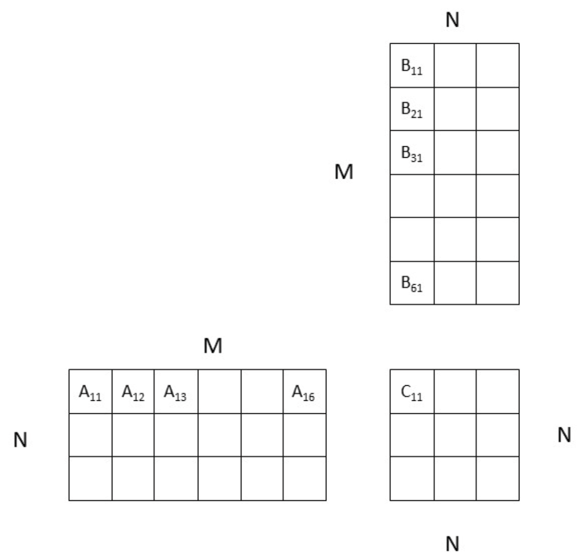

<h1>Assignment 4 - Due date: Sep 4, 2022</h1>

_Hello GPU._

[TOC]

---

## Lab: GPU Acceleration with Jetson

Today, we'll be digging into the capabilities of GPU acceleration on the Jetson.

### Setup? Visual display forwarding

Interfacing through Jupyter can get a bit slow.
If you prefer, you can use ssh display tunneling or VNC to work on the Jetson:

  
SSH Display Tunneling

Ensure that your host machine has an X server installed.  For Windows, you can use [vcxsrv](https://sourceforge.net/projects/vcxsrv/).  For macOS [XQuartz](https://www.xquartz.org/).  On most Linux Distributions, you likely already have an X server.

On your host machine, execute the following to enable X-fowarding:

    $ ssh -XY wes-237b@192.168.55.1

If you are using PUTTY instead, ensure that you have enabled X-forwarding under your SSH options.

An alternative option on Windows is to use [MobaXterm](https://mobaxterm.mobatek.net/), which allows you to graphically configure both the X server and the SSH connection.

To test your X-forwarding, you can run `gedit`.

It is additionally possible to use X-forwarding in Visual Studio Code.  To do so edit `~/.ssh/config` and update your entry for the Jetson to match the following, then restart Visual Studio Code.

  Host 192.168.55.1
    HostName 192.168.55.1
    ForwardX11 yes
    ForwardX11Trusted yes
    User wes-237b

  
VNC Setup

On TX2:

    $ sudo apt update
    $ sudo apt install xfce4 xfce4-goodies
    $ sudo apt install tightvncserver
    $ vncserver

Output:
> You will require a password to access your desktops.
>
> Password:
> Verify:
>
> Would you like to enter a view-only password (y/n)? n

We need to configure the graphical interface:

    $ vncserver -kill :1
    $ mv ~/.vnc/xstartup ~/.vnc/xstartup.bak
    $ vim ~/.vnc/xstartup

Here we add the following to the new file.
Hit "i" to insert the following:

    #!/bin/bash
    xrdb $HOME/.Xresources
    startxfce4 &

Now hit `esc` key and type `:wq` then `enter`.

    $ sudo chmod +x ~/.vnc/xstartup
    $ vncserver :1 -geometry 1920x1080

On your laptop:

Use a remote desktop client and connect to `<your_tx2_ip_address>:` using VNC with the password you selected previously.

### Background and Resources

Here are some [slides to follow along with][slides] for today's lab.

### Part 1: CUDA Hello World

To start, download [`lab4-part1.zip`](lab4-part1.zip).
<small>Convention note: `.cc` is yet-one-more extension people use for C++ files; `.cu` is CUDA code.</small>

Start by compiling both versions of the provided main program:

    $ g++ main.cc -o hello_cpu
    $ nvcc main.cu -o hello_gpu

Make sure each of these programs execute as-expected.

#### Example 1: Basic Memory Allocation

Now take a look at `ex1.cu`.
Follow through the description in the [lab slides][slides] and read the code.
Do you understand how the allocation and freeing works?

**Deliverable:** Explain in plain English what this example does.

#### Example 2: Scope?

Now take a look at `ex2.cu`.
Follow through the description in the [lab slides][slides] and read the code.
What differs between example 1 and example 2?

**Deliverable:** Succinctly explain the difference between examples 1 and 2, and what is significant about it.

#### Implementing Matrix Multiply Two Ways

Now you will have to write some code yourself.
We are going to implement matrix multiply under two separate memory management schemes.

First, check out `lw.cu`.
We have put together most of the CUDA scaffolding for you.
Your task is to implement the kernel that will execute on the GPU (i.e. fill out the `myKernel()` method).

You have _two_ things to consider here:

 - How do I implement the actual multiplication (loop, multiply and sum)?
 - How do I make sure this kernel is working on the right part of the matrix (remember that magic `threadIdx` variable from the examples)?

Once you have your kernel working correctly, copy it into `lw_managed.cu`.
This is a different scaffolding setup, but can use the same kernel to multiply.
Take a look at how the setup code differs between `lw.cu` and `lw_managed.cu`.

**Deliverables:**

 - Provide a copy of your `myKernel()` implementation.
 - Succinctly explain the difference between the two `lw` implementations.

<!--
__global__ void myKernel(int *m, int *v, int *r){
    uint offset = threadIdx.x * 3;
    uint sum = 0;
    for(uint i=0; i<3; i++){
        sum += m[offset + i]*v[i];
    }
    r[threadIdx.x] = sum;
}
-->

### Part 2: GPU-Accelerated Image Manipulation

In this part of the lab, we will implement some common image manipulation techniques: greyscale conversion, inversion, and blurring.

To start, download [`lab4-part2.zip`](lab4-part2.zip).

#### A CPU Baseline

We will first implement greyscale conversion on the CPU to make sure your implementation is working as-expected:

1. In `src/img_proc.cu`, complete the function `img_rgb2gray_cpu()` to convert an `N`-channel (3 in this case) image to a 1-channel image by averaging the `N` channels.
2. In `src/main.cpp`, call the `img_rgb2gray_cpu()` function.
    2. Under the CPU case of the `while()` loop, add:

             img_rgb2gray_cpu(gray.ptr<uchar>(), rgb.ptr<uchar>(), WIDTH, HEIGHT, CHANNELS);

3. Compile and run using `./lab4 1`.
    3. Compare with OpenCV (using `./lab4 0`).

#### GPU, with separate memory

Now, let's move to the GPU.

You may find the image indexing at the end of the [lab slides][slides] a useful reference.

##### Implement and call your algorithm

We'll have to make some changes to `img_proc.cu`.

The changes/additions here are the actual algorithm implementation on the GPU and a wrapper function to be called on the host:

1. Add a new kernel function under `//========GPUKernelFunctions========`.
   This function needs to run on the device and be called from the host.
   The GPU function will have the same parameters as the CPU function.
    1. Your CPU function should have two nested `for()` loops to loop over the entire image.
       In the GPU kernel function, these loops should be replaced with the block and thread indexes.
    2. For the most part, the rest of the function will remain untouched.
2. Add a wrapper function to call your kernel function under `//========GPUHostFunctions========`
   This function will be called from `main()` and needs to define the grid and block and to launch the kernel function.

**Hint:** Having trouble with indicies? Check out the [nVidia CUDA basics slides][nvidia-basics], in particular the "Combining Threads and Blocks" section (starts on PDF-page 37).

##### Setup memory and get things going

We'll have to make some changes to `main.cpp`.

The changes here will manage the GPU device memory and calling the wrapper function we wrote above.
**We're NOT using unified memory.**

1. Make sure `#define UNIFIED_MEMORY` is commented out at the top of `main.cpp`.
2. Allocate memory on the device.
    1. Declare `unsigned char* gray_device`.
    2. Allocate the `gray_device` memory for the GPU device:

             cudaMalloc((void **)&gray_device, <SIZE_TO_ALLOCATE>);

    3. Declare:

             unsigned char* rgb_device;

    4. Allocate the `rgb_device` memory for the GPU device:

             cudaMalloc((void **)&rgb_device, <SIZE_TO_ALLOCATE>);

3. Under the GPU case, copy the data from host->device, call the GPU wrapper function, and copy data from device->host.
    1. Copy from host -> device. This is copying the input data to our function.  This will be the 3-channel RGB array. (rgb -> rgb_device):

             cudaMemcpy(<PTR_TO_DEVICE_MEM>, <PTR_TO_HOST_MEM>, <SIZE_TO_COPY>, cudaMemcpyHostToDevice);

    2. Call the host wrapper we wrote previously `img_rgb2gray_gpu()`. The parameters require us to pass a pointer to the output and a pointer to the input, these are pointers to the device memory locations.
    3. Copy the result from device -> host. This is copying the output from the device memory to the host (gray_device -> gray).

             cudaMemcpy(<PTR_TO_HOST_MEM>, <PTR_TO_DEVICE_MEM>, <SIZE_TO_COPY>, cudaMemcpyDeviceToHost);

4. Compile and run the GPU code using `./lab4 2`.

#### GPU, with unified memory

There is also memory that can be shared by host and device.
The benefit of this is less code, but it is often less efficient than allocated device memory.

1. Change the device allocation to:

        cudaMallocManaged(&gray_device, <SIZE_TO_AOLLOCATE>);

2. Change the matrix definition to use the `gray_device` memory:

        Mat gray = Mag(HEIGHT, WIDTH, CV_8U, gray_device);

3. Do the same changes for `rgb_device`.
4. Call the wrapper function:

        img_rgb2gray_gpu(gray.ptr<uchar>(), rgb.ptr<uchar>, ...);

Notice the benefit of not having to write code to copy the data every time.
What are the computation benefits/downfalls to each method?

#### Image Inversion

Repeat the above steps, but the kernel function will invert the image `(pixval = 255 - pixval)`.

#### Image Blur

Repeat the above steps, but the kernel function will average a `BLUR_SIZE` square of pixels.

### Part 2 Deliverables

1. Submit all of your final code for Part 2.
2. For each algorithm (greyscale, inversion, blur), which implementation has the best performance? Make a quantitative case.

---

## Assignment: CUDA for Familiar Tasks

In this assignment, you will learn more about GPU programming.
You will need to develop and run your code on the Jetson TX2 board.

We have provided starter code: [`assignment4.zip`](assignment4.zip).

### Part 1: Sobel filter

For this part, you can use the `input.raw` video that is provided.
Complete the `filter.cu` file to encode a Sobel filter on the GPU.
You can reuse any code from previous assignments.
Keep note of the following items you will need to complete:

In `filter.cu`:

1. Complete a CPU implementation
2. Complete the kernel function
3. Complete the host wrapper function that launches the kernel. Experiment with different block and grid sizes and report on the performances.

In `main.cpp`:

1. Allocate the correct memory on the device (you can use unified memory for the assignment).
2. Call the CPU/GPU functions appropriately.
3. Free the memory you allocated.

Once everything is implemented:

 - Run with OpenCV: `./sobel 1024 1024 0`
 - Run CPU code: `./sobel 1024 1024 1`
 - Run GPU code: `./sobel 1024 1024 2`

**Deliverables:**

Report the approximate execution times for OpenCV Sobel, CPU Sobel, and GPU Sobel, for different sizes.

You can use square sizes from 512 to 4096 (note: your code should still work for non-square sizes).

Note that for smaller sizes, the FPS will be limited by the camera FPS, and beyond 1024, the images will not display. If you wish, you can completely disable the display (comment out "imshow" in `main.cpp`) for all sizes to get a more stable result for the GPU.

### Part 2: Blocked matrix multiplication

In this part, you will multiply two matrices using shared (unified) memory.
Make sure you carefully read the description of the problem.

#### Description

- You will perform `C = AB` where `A`, `B`, and `C` are matrices of float values.
- The size of `A` is `NxM`, the size of `B` is `MxN`, and the size of `C` is `NxN`. To clarify: `A` has `N rows` and `M columns`, `B` has `M rows` and `N columns`, `C` is square with `N rows` and `N columns`.
- `M` can be smaller, equal, or larger than `N`.
- You must perform the multiplication using shared memory. We provide hints below to help you.
- The block size is the same on `X` and `Y`, and is defined as a constant. However, your code should still work if we change the provided block size value.
- You can assume that `M` and `N` are multiples of the block size. No need for edge cases.
- The RMSE should be small, below 0.001.

#### Tasks
1. Complete a block matrix multiplication function in `matrixmul.cu`.
2. Run your code for various sizes of `M` and `N`, from 16 to 1024. Report the speedup for each case (we expect at least 5-6 data points, showing the increase of the speedup, and for both `M > N` and `M < N`).
3. Experiment to find the optimal block/grid size (see hints below) to launch your kernel function (this may change depending on the size of your block matrices and the size of your image. To account for this, fix your image size and find the optimal block/grid and block matrix size). Verify your decision with data.

#### Hints
You will launch `NxN` threads (one per output), divided into blocks of size `SxS`.
We will illustrate what happens inside each thread with the example below:

- Let's take C11 as an example.
- C11 is a block of `SxS` threads. Inside the block C11, the threads will first load A11 and B11 into shared memory. Very simply, each thread can load one value from A11 and one value from B11.
- The threads need to synchronize, then perform A11 x B11. This means that each thread multiplies one row of A11 by one column of B11.
- Then threads synchronize and load A12 and B21 into shared memory. They synchronize and perform A12 x B21. This will repeat for all the blocks until (in this example) A16 and B61 (in reality, you do not have 6 blocks, but `N/S` blocks). Then the cumulative result is saved into C11 (each thread saves one value).
- All the other C blocks (C12, C13, etc.) perform the same task simultaneously.

**Deliverables:** Your final source code and the performance measures requested above.

---

## What to Submit

Prepare a report document with answers for each of the `Report Deliverables` above.

### Lab
#### Part 1
1. Explain in plain English what example 1 does.
2. Explain the difference between example 1 and example 2.  What is significant about it?
3. Provide a copy of your `myKernel()` implementation from your matrix multiplication.
4. Explain the difference between the two `lw` implementations.

#### Part 2
1. Submit all of your final code for Part 2.
2. For each algorithm (greyscale, inversion, blur), which implementation has the best performance? Make a quantitative case.

### Assignment
#### Part 1
Report the approximate execution times for OpenCV Sobel, CPU Sobel, and GPU Sobel, for different sizes.

You can use square sizes from 512 to 4096 (note: your code should still work for non-square sizes).

Note that for smaller sizes, the FPS will be limited by the camera FPS, and beyond 1024, the images will not display. If you wish, you can completely disable the display (comment out "imshow" in main.cpp) for all sizes to get a more stable result for the GPU.

#### Part 2
Your final source code and the performance measures requested above.

---

## Additional Resources

 - [CUDA Basics Presentation][nvidia-basics] from nVidia.

[slides]: wes237b-su22-LAB-04-GPUAccel.pdf
[nvidia-basics]: https://www.nvidia.com/docs/IO/116711/sc11-cuda-c-basics.pdf
